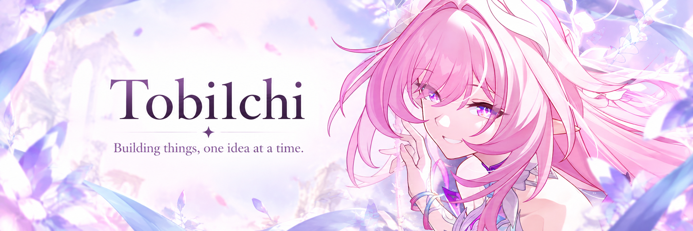

  

### Agent systems, embedded hardware, and the tools in between.

Building ways for people, AI agents, and physical devices to work together.

[Projects](#selected-projects) · [GitHub](https://github.com/Tobi1chi) · [LinkedIn](https://www.linkedin.com/in/guanlun-sun-3b3681301/)

---

### A little about my work

My work spans human–agent collaboration and embedded systems: helping people guide complex agent tasks, connecting microphone nodes to AI software, and building DIY flight-sim controls.

I also collect reusable skills and scripts for electronics, academic writing, and everyday automation.

### Currently building · EHAI

**Enhanced Human-Agent Interface**

I'm developing a planning and execution core for agent workflows, starting with coding tasks. The aim is to let people review a plan, guide execution, and judge results against the original goal—with a way to pause, recover, and ask for human input when needed.

*In development · Private repository · Public release planned*

### Selected projects

| Project | What it does |
| :--- | :--- |
| **[Cyrene-Agent](https://github.com/Tobi1chi/Cyrene-Agent)** | A Cyrene-inspired Live2D desktop AI companion, bringing conversation, memory, voice, and tools into everyday work and learning. |
| **[EchoTrigger](https://github.com/Tobi1chi/EchoTrigger)** | Audio capture, short-term replay, and speech transcription for AI agents, with ESP32-S3 reference hardware and an MCP interface. |
| **[Skills & Small Tools](https://github.com/Tobi1chi/Skills-and-SmallTools)** | Reusable agent skills and scripts for circuit workflows, paper review, project documentation, and automation. |
| **[VTOL VR Rudder Pedal](https://github.com/Tobi1chi/Vtol-VR-Rudder-Pedal)** | A low-cost DIY rudder pedal for VTOL VR and other flight simulators. |
| **[STM32 Environment Template](https://github.com/Tobi1chi/STM32_EnvironmentTemplate)** | A development environment template for STM32 projects across platforms. |

### In the workshop

**Embedded** · ESP32-S3 / ESP-IDF / STM32 / C++  
**Software** · Python / TypeScript / Electron / MCP  
**Electronics tools** · JLCEDA / ngspice

---

   
  The finest blessing in this world — tomorrow, we meet. 
  明天见，桃子

Cyrene / 昔涟 · Honkai: Star Rail · HoYoverse. <a href="./ASSETS.md">Artwork sources</a>.

